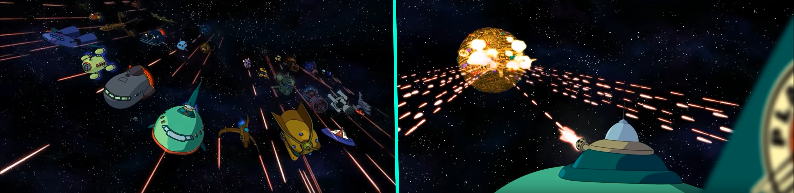
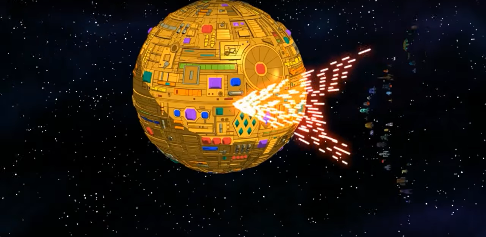
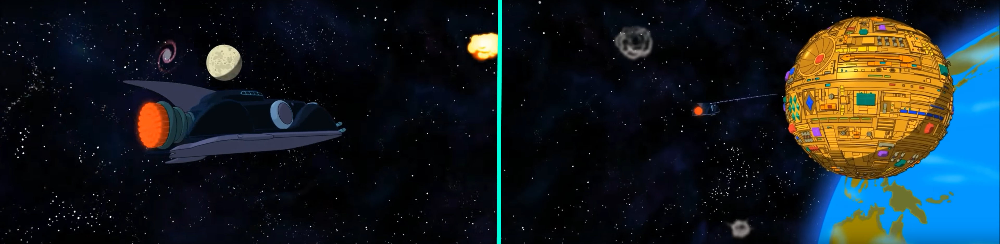
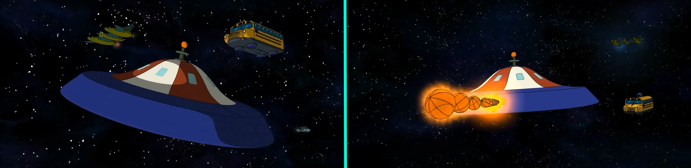
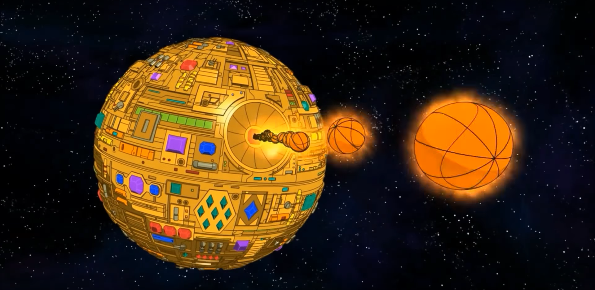
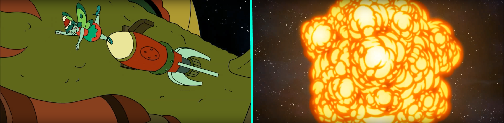

# FuturamaBattle
A recreation of the futurama space battle from the episode Benders big score. I used probuilder in unity to model low poly poly ships for this project

The first scene will show all of the ships in a v flock shape shooting the first golden death star

The bullets will all target the same target on the deathstar to make this pattern

Scene 2 will follow the gang ship shooting at another deathstar with a tommy gun

Scene 3 will show a few of the ships doing the banking steering behaviour

The globetrotters ship will shoot basketballs at another one of the deathstars

Scene 4 will follow this small rocket to destroy the last deathstar.

